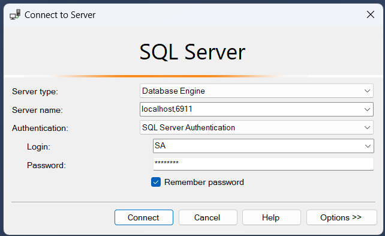

# Logitar.Data.SqlServer.IntegrationTests

This project provider integration tests for the Logitar.Data.SqlServer project. In order to run the
integration tests, you must have a running Microsoft SQL Server database. The easiest way to do so
is by using Docker and running the following command, using the default values. The connection
string is already configured in the `appsettings.json` file.

`docker run --name Logitar.NET_sqlserver -e "ACCEPT_EULA=Y" -e "MSSQL_SA_PASSWORD=faQphSAm596DxBN4" -p 1434:1433 -d mcr.microsoft.com/mssql/server:2022-latest`

You must create a database in order to run the integration tests. You may do so be downloading and
installing **SQL Server Management Studio (SSMS)**. You may login using the information in the
connection string. See the image below for more detail.

You may then expand the `Databases` object in the left pane, right-click the `Databases` object,
then click `New Database...`. Specify the database name `LogitarData_SqlTests`, leaving the default
values for the other fields, then click `OK`. You may now run the integration tests.
